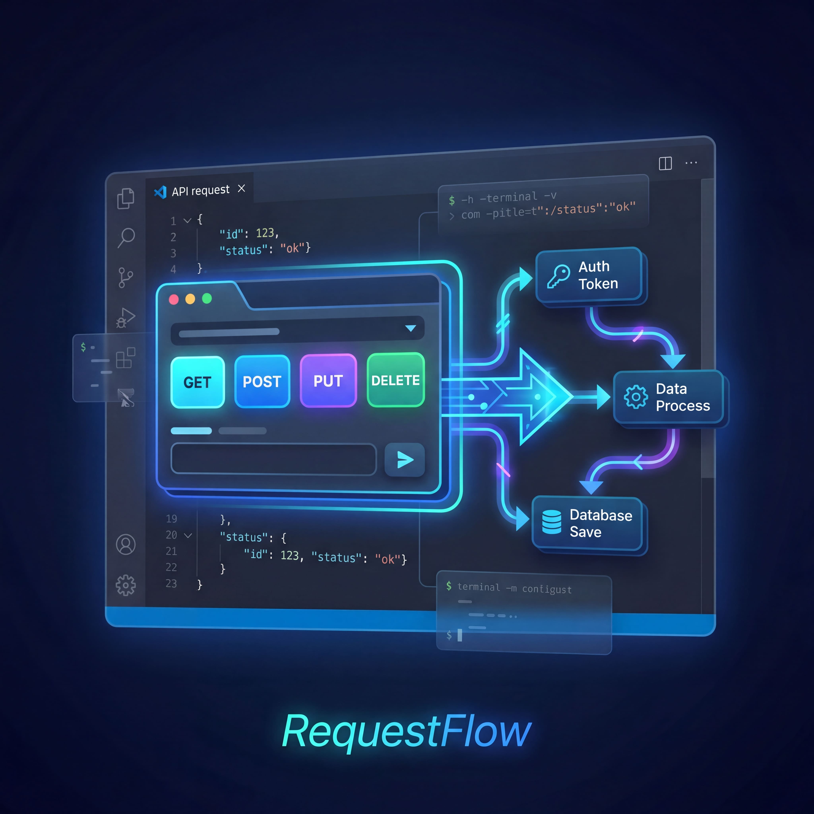

# RequestFlow Feedback

Public community space for RequestFlow feedback.

	

	

This repository is for:

- Bug reports
- Improvement proposals
- Product feedback
- Community discussions

This repository is not for:

- Source code
- External pull requests

## Quick links

- Marketplace: https://marketplace.visualstudio.com/items?itemName=requestflow.requestflow
- Discussions: https://github.com/miguelmatg/requestflow-feedback/discussions
- Report a bug: https://github.com/miguelmatg/requestflow-feedback/issues/new?template=bug_report.yml
- Suggest an improvement: https://github.com/miguelmatg/requestflow-feedback/issues/new?template=improvement_request.yml
- Security policy: see SECURITY.md

## Scope

The RequestFlow codebase is maintained in a private repository.
Community feedback from this repository is triaged and tracked by maintainers.

## Contribution policy

This repository is issues-only and discussions-enabled.
External code contributions and pull requests are not accepted at this time.

See CONTRIBUTING.md for details.
